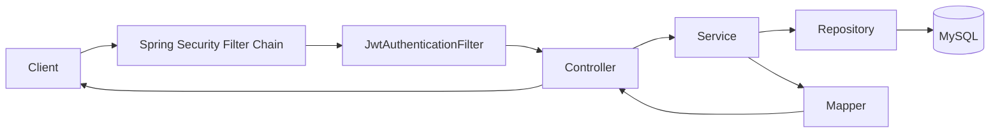
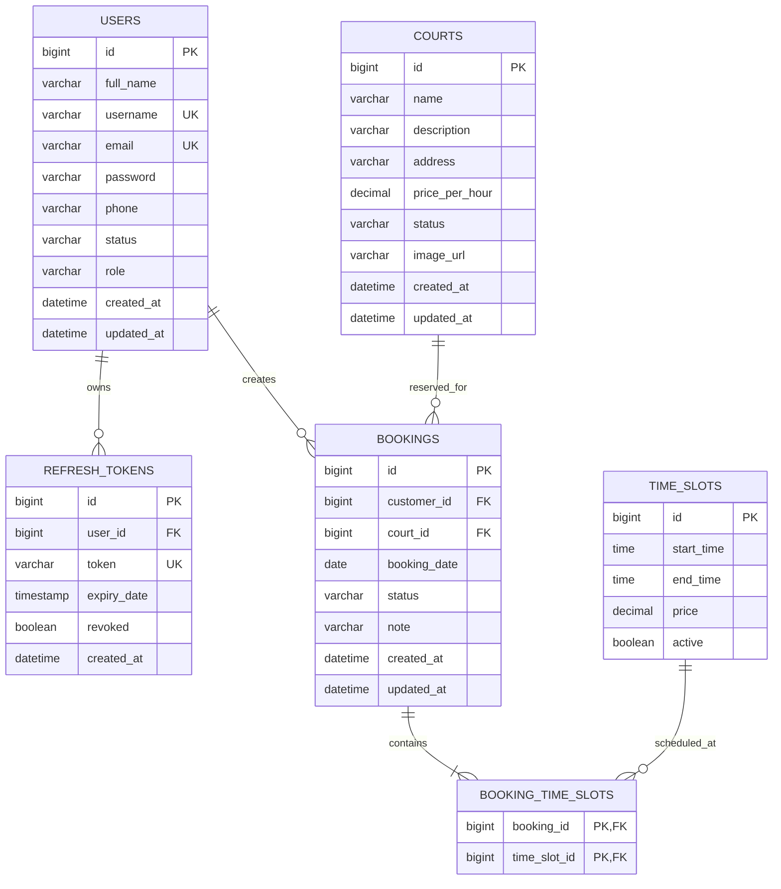
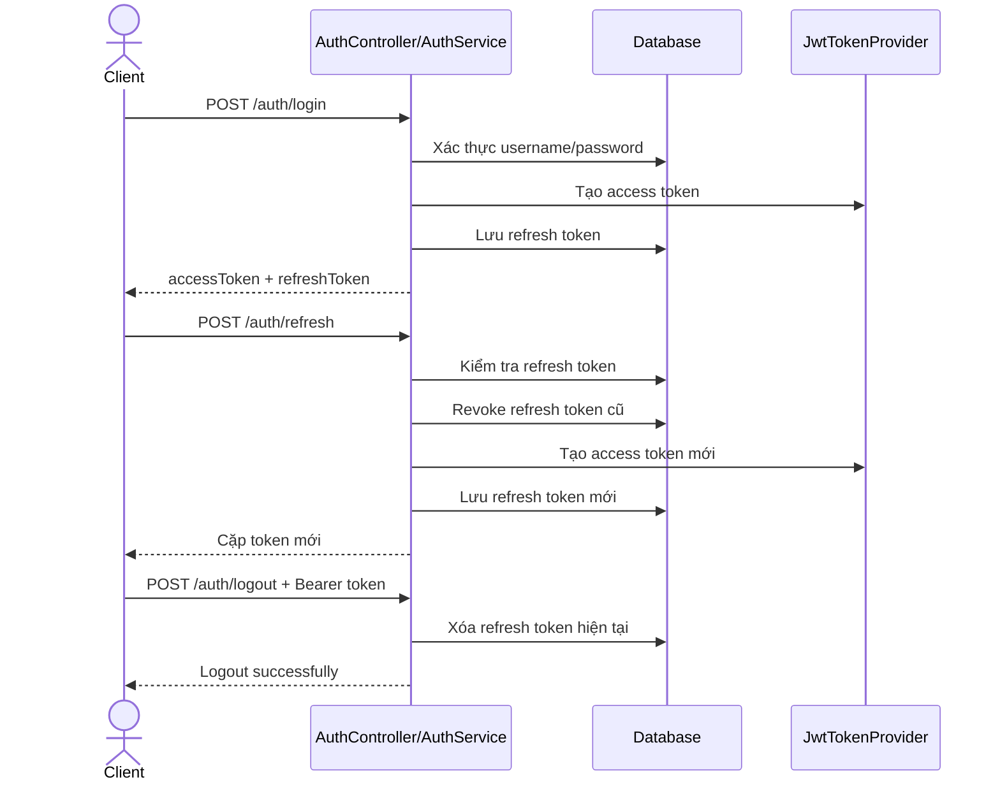
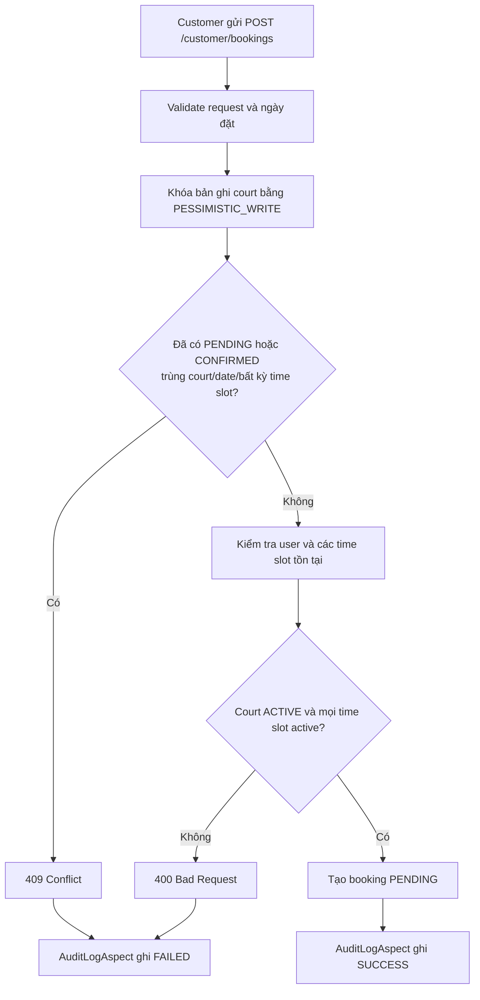
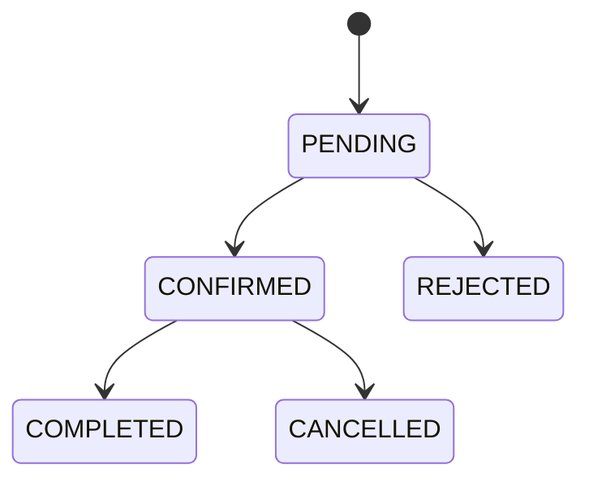
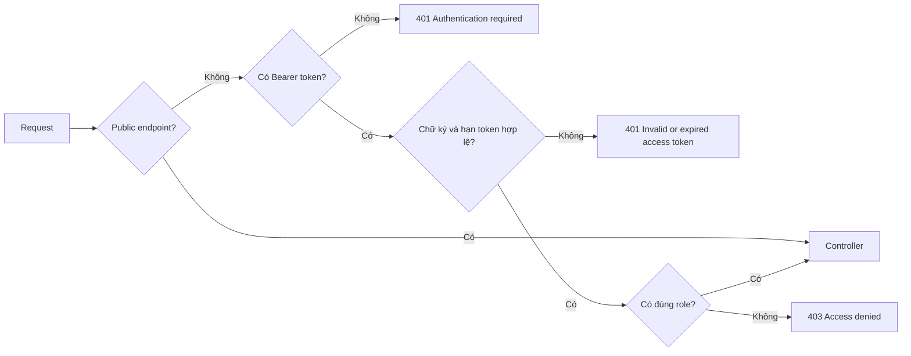

# Badminton Booking System

Backend RESTful API cho hệ thống quản lý và đặt sân cầu lông. Dự án cung cấp các chức năng xác thực bằng JWT, phân quyền theo vai trò, quản lý người dùng, sân, khung giờ, booking, upload ảnh và ghi audit log cho nghiệp vụ đặt sân.

## Mục lục

- [Tính năng chính](#tính-năng-chính)
- [Công nghệ sử dụng](#công-nghệ-sử-dụng)
- [Kiến trúc và cấu trúc dự án](#kiến-trúc-và-cấu-trúc-dự-án)
- [Cấu trúc database](#cấu-trúc-database)
- [Cài đặt và chạy dự án](#cài-đặt-và-chạy-dự-án)
- [Tài khoản demo](#tài-khoản-demo)
- [Quy ước API](#quy-ước-api)
- [Danh sách endpoint](#danh-sách-endpoint)
- [Flow endpoint](#flow-endpoint)
- [Bảo mật endpoint](#bảo-mật-endpoint)
- [Upload và truy cập ảnh](#upload-và-truy-cập-ảnh)
- [Kiểm thử và format code](#kiểm-thử-và-format-code)
- [Lưu ý khi triển khai production](#lưu-ý-khi-triển-khai-production)

## Tính năng chính

- Đăng ký, đăng nhập, refresh token, logout và đổi mật khẩu.
- JWT access token theo mô hình stateless, không sử dụng session phía server.
- Refresh token và access token đã thu hồi được lưu trong database.
- Phân quyền theo vai trò `ADMIN`, `MANAGER`, `CUSTOMER`.
- Quản lý người dùng và cập nhật hồ sơ cá nhân.
- Quản lý sân cầu lông, trạng thái sân và ảnh sân.
- Quản lý các khung giờ đặt sân.
- Customer tạo và xem booking của chính mình.
- Manager/Admin xem và cập nhật trạng thái booking.
- Ngăn đặt trùng sân theo sân, ngày và khung giờ.
- Ghi audit log khi tạo booking thành công hoặc thất bại.
- Xử lý validation và exception tập trung.
- Phân trang, sắp xếp và lọc dữ liệu.

## Công nghệ sử dụng

| Thành phần                   | Công nghệ                         |
| ---------------------------- | --------------------------------- |
| Ngôn ngữ                     | Java 21                           |
| Framework                    | Spring Boot 3.3.5                 |
| Build tool                   | Gradle Wrapper, Gradle Groovy DSL |
| REST API                     | Spring Web                        |
| Authentication/Authorization | Spring Security, JWT              |
| Persistence                  | Spring Data JPA, Hibernate        |
| Database runtime             | MySQL 8                           |
| Database test                | H2 in-memory                      |
| Validation                   | Jakarta Validation                |
| Audit nghiệp vụ              | Spring AOP                        |
| JWT library                  | JJWT 0.12.6                       |
| Boilerplate reduction        | Lombok                            |
| Code format                  | Spotless, Eclipse Java Formatter  |

## Kiến trúc và cấu trúc dự án

Dự án được chia theo module nghiệp vụ. Trong mỗi module:

- `controller`: nhận HTTP request, validate input và trả response.
- `service`: xử lý business logic và transaction.
- `repository`: truy vấn database qua Spring Data JPA.
- `entity`: ánh xạ bảng database.
- `dto`: định nghĩa request/response, không trả entity trực tiếp ra API.
- `mapper`: chuyển entity sang response DTO.

```text
.
├── build.gradle
├── settings.gradle
├── gradlew
├── config/
│   └── eclipse-java-formatter.xml
├── uploads/
│   └── courts/                         # Được tạo khi upload ảnh
└── src/
    ├── main/
    │   ├── java/com/project/
    │   │   ├── ProjectApplication.java
    │   │   ├── aspect/
    │   │   │   └── AuditLogAspect.java
    │   │   ├── common/
    │   │   │   ├── enums/
    │   │   │   ├── exception/
    │   │   │   ├── response/
    │   │   │   └── util/
    │   │   ├── config/                 # Security, CORS, static resource
    │   │   ├── data/
    │   │   │   └── DataInitializer.java
    │   │   ├── security/
    │   │   │   ├── handler/
    │   │   │   ├── jwt/
    │   │   │   └── user/
    │   │   └── modules/
    │   │       ├── audit/
    │   │       ├── auth/
    │   │       ├── booking/
    │   │       ├── court/
    │   │       ├── storage/
    │   │       ├── timeslot/
    │   │       └── user/
    │   └── resources/
    │       └── application.properties
    └── test/
        ├── java/com/project/
        └── resources/application.properties
```

### Luồng xử lý request chung



## Cấu trúc database

Schema MySQL đầy đủ nằm tại `init.sql`. File sử dụng `CREATE DATABASE/TABLE IF NOT EXISTS`, vì vậy có thể chạy
lặp lại mà không xóa dữ liệu hiện có.

Nếu database đã được tạo từ phiên bản mỗi booking chỉ có một time slot, chạy migration một lần trước khi khởi động
phiên bản mới:

```bash
mysql -u root -p < src/main/resources/migrate_booking_to_multiple_time_slots.sql
```

Nếu database đã có sân trước khi bổ sung phân quyền quản lý theo sân, chạy migration:

```bash
mysql -u root -p < src/main/resources/migrate_court_managers.sql
```

Migration gán các sân cũ chưa có quản lý cho toàn bộ manager hiện tại để không làm mất quyền truy cập đang có.

Ứng dụng vẫn sử dụng JPA/Hibernate với:

```properties
spring.jpa.hibernate.ddl-auto=update
```

Vì vậy Hibernate vẫn có thể bổ sung các thay đổi nhỏ khi ứng dụng khởi động. Tên cột thực tế được chuyển từ
camelCase sang snake_case.

### Sơ đồ quan hệ



Các bảng độc lập phục vụ audit:

| Bảng         | Mục đích                                 | Trường chính                                                  |
| ------------ | ---------------------------------------- | ------------------------------------------------------------- |
| `audit_logs` | Ghi nhận tạo booking thành công/thất bại | `id`, `username`, `action`, `message`, `status`, `created_at` |

### Enum và trạng thái

| Enum            | Giá trị                                                      |
| --------------- | ------------------------------------------------------------ |
| `RoleName`      | `ADMIN`, `MANAGER`, `CUSTOMER`                               |
| `UserStatus`    | `ACTIVE`, `LOCKED`, `DISABLED`                               |
| `CourtStatus`   | `ACTIVE`, `INACTIVE`, `MAINTENANCE`                          |
| `BookingStatus` | `PENDING`, `CONFIRMED`, `REJECTED`, `CANCELLED`, `COMPLETED` |

### Quy tắc dữ liệu quan trọng

- `users.username` và `users.email` là duy nhất.
- Mỗi user có một role tại cột `users.role`.
- URL ảnh sân được lưu trực tiếp tại `courts.image_url`.
- Cặp `time_slots.start_time` và `time_slots.end_time` là duy nhất.
- Xóa user là soft delete: chuyển `status` sang `DISABLED`.
- Xóa sân là soft delete: chuyển `status` sang `INACTIVE`.
- Xóa time slot là soft delete: chuyển `active` sang `false`.
- Booking mới luôn có trạng thái `PENDING`.
- Một booking phải có ít nhất một time slot và không được chứa time slot trùng lặp.
- Booking `PENDING` hoặc `CONFIRMED` sẽ chặn booking khác nếu trùng sân, ngày và bất kỳ time slot nào.
- Khi tạo booking, sân được khóa bằng `PESSIMISTIC_WRITE` trong transaction để giảm race condition đặt trùng.
- Hiện tại database chưa có unique constraint trực tiếp cho tổ hợp sân, ngày và time slot.

## Cài đặt và chạy dự án

### Yêu cầu môi trường

- JDK 21
- MySQL 8+
- Không cần cài Gradle riêng vì dự án đã có Gradle Wrapper.

### 1. Tạo database

Khởi tạo database và toàn bộ bảng bằng:

```bash
mysql -u root -p < init.sql
```

File có thể chạy lại mà không xóa bảng hoặc dữ liệu hiện có. Ba tài khoản demo được `DataInitializer` tạo khi ứng
dụng khởi động lần đầu, không được hard-code trong SQL.

Nếu chỉ muốn tạo database trống và để Hibernate tạo bảng, JDBC URL hiện tại vẫn hỗ trợ
`createDatabaseIfNotExist=true`.

### 2. Cấu hình

Cấu hình mặc định nằm tại `src/main/resources/application.properties`:

| Property                                    | Mặc định                                     | Ý nghĩa                          |
| ------------------------------------------- | -------------------------------------------- | -------------------------------- |
| `server.port`                               | `8080`                                       | Cổng chạy ứng dụng               |
| `spring.datasource.url`                     | MySQL local, database `badminton_booking_db` | JDBC URL                         |
| `spring.datasource.username`                | `root`                                       | Database username                |
| `spring.datasource.password`                | `123456`                                     | Database password                |
| `app.jwt.access-token-expiration-ms`        | `1800000`                                    | Access token hết hạn sau 30 phút |
| `app.jwt.refresh-token-expiration-ms`       | `604800000`                                  | Refresh token hết hạn sau 7 ngày |
| `app.file.upload-dir`                       | `uploads`                                    | Thư mục lưu file                 |
| `app.file.public-path`                      | `/uploads`                                   | Public URL prefix                |
| `spring.servlet.multipart.max-file-size`    | `10MB`                                       | Dung lượng tối đa mỗi file       |
| `spring.servlet.multipart.max-request-size` | `50MB`                                       | Dung lượng tối đa mỗi request    |

Spring Boot cho phép override bằng biến môi trường. Ví dụ:

```bash
export SPRING_DATASOURCE_URL='jdbc:mysql://localhost:3306/badminton_booking_db?createDatabaseIfNotExist=true&useSSL=false&serverTimezone=Asia/Ho_Chi_Minh'
export SPRING_DATASOURCE_USERNAME='root'
export SPRING_DATASOURCE_PASSWORD='your-password'
export APP_JWT_SECRET='your-secret-key-at-least-256-bits'
```

### 3. Chạy ứng dụng

macOS/Linux:

```bash
./gradlew bootRun
```

Windows:

```bat
gradlew.bat bootRun
```

Base URL:

```text
http://localhost:8080/api/v1
```

Khi khởi động lần đầu, `DataInitializer` tự tạo ba role và ba tài khoản demo nếu username tương ứng chưa tồn tại.

## Tài khoản demo

| Vai trò  | Username   | Password |
| -------- | ---------- | -------- |
| Admin    | `admin`    | `123456` |
| Manager  | `manager`  | `123456` |
| Customer | `customer` | `123456` |

## Quy ước API

### Authorization header

Các endpoint được bảo vệ yêu cầu access token:

```http
Authorization: Bearer <access-token>
```

### Response thành công

```json
{
  "success": true,
  "message": "Courts retrieved",
  "data": {}
}
```

Endpoint trả danh sách phân trang sử dụng cấu trúc:

```json
{
  "success": true,
  "message": "Bookings retrieved",
  "data": {
    "content": [],
    "page": 0,
    "size": 20,
    "totalElements": 0,
    "totalPages": 0
  }
}
```

### Response lỗi

```json
{
  "timestamp": "2026-06-10T10:30:00",
  "status": 400,
  "error": "Bad Request",
  "message": "startTime: must not be null",
  "path": "/api/v1/admin/time-slots"
}
```

| HTTP status                 | Ý nghĩa thường gặp                                         |
| --------------------------- | ---------------------------------------------------------- |
| `200 OK`                    | Request thành công                                         |
| `201 Created`               | Tạo resource thành công                                    |
| `204 No Content`            | Soft delete thành công                                     |
| `400 Bad Request`           | Validation lỗi hoặc nghiệp vụ không hợp lệ                 |
| `401 Unauthorized`          | Chưa đăng nhập, sai thông tin đăng nhập hoặc token hết hạn |
| `403 Forbidden`             | Không đủ quyền hoặc access token đã bị revoke              |
| `404 Not Found`             | Không tìm thấy resource                                    |
| `409 Conflict`              | Trùng username/email/time slot hoặc booking bị trùng       |
| `500 Internal Server Error` | Lỗi không được xử lý cụ thể                                |

### Phân trang và sắp xếp

Các endpoint dùng `Pageable` hỗ trợ query parameter chuẩn của Spring:

```text
?page=0&size=10&sort=createdAt,desc
```

`page` bắt đầu từ `0`. Mặc định Spring sử dụng `page=0` và `size=20`.

## Danh sách endpoint

Ký hiệu quyền:

- `Public`: không cần access token.
- `Authenticated`: mọi user đã đăng nhập.
- `Customer`: yêu cầu `ROLE_CUSTOMER`.
- `Manager/Admin`: yêu cầu `ROLE_MANAGER` hoặc `ROLE_ADMIN`.
- `Admin`: yêu cầu `ROLE_ADMIN`.

### Auth

| Method | Endpoint                       | Quyền         | Request body                                          | Mô tả                                                       |
| ------ | ------------------------------ | ------------- | ----------------------------------------------------- | ----------------------------------------------------------- |
| `POST` | `/api/v1/auth/register`        | Public        | `fullName`, `username`, `email`, `password`, `phone?` | Đăng ký customer và trả cặp token                           |
| `POST` | `/api/v1/auth/login`           | Public        | `username`, `password`                                | Đăng nhập và trả cặp token                                  |
| `POST` | `/api/v1/auth/refresh`         | Public        | `refreshToken`                                        | Rotate refresh token và tạo cặp token mới                   |
| `POST` | `/api/v1/auth/logout`          | Authenticated | `refreshToken`                                        | Xóa refresh token hiện tại                                   |
| `POST` | `/api/v1/auth/change-password` | Authenticated | `currentPassword`, `newPassword`                      | Đổi mật khẩu                                                |
| `POST` | `/api/v1/auth/forgot-password` | Public        | `email`                                               | Kiểm tra email tồn tại; chưa gửi email/reset token          |

### Profile và quản lý user

| Method   | Endpoint                   | Quyền         | Request/query                                                   | Mô tả                     |
| -------- | -------------------------- | ------------- | --------------------------------------------------------------- | ------------------------- |
| `GET`    | `/api/v1/profile`          | Authenticated | -                                                               | Lấy profile hiện tại      |
| `PUT`    | `/api/v1/profile`          | Authenticated | `fullName`, `email`, `phone?`                                   | Cập nhật profile hiện tại |
| `GET`    | `/api/v1/admin/users`      | Admin         | `keyword?`, phân trang                                          | Tìm kiếm danh sách user   |
| `GET`    | `/api/v1/admin/users/{id}` | Admin         | Path `id`                                                       | Lấy user theo ID          |
| `POST`   | `/api/v1/admin/users`      | Admin         | `fullName`, `username`, `email`, `password`, `phone?`, `role?` | Tạo user                  |
| `PUT`    | `/api/v1/admin/users/{id}` | Admin         | `fullName`, `email`, `phone?`, `status?`, `role?`              | Cập nhật user             |
| `DELETE` | `/api/v1/admin/users/{id}` | Admin         | Path `id`                                                       | Soft delete user          |

### Court và ảnh sân

| Method   | Endpoint                                  | Quyền         | Request/query                                                | Mô tả                    |
| -------- | ----------------------------------------- | ------------- | ------------------------------------------------------------ | ------------------------ |
| `GET`    | `/api/v1/courts`                          | Public        | `name?`, `status?`, `minPrice?`, `maxPrice?`, phân trang     | Tìm kiếm sân             |
| `GET`    | `/api/v1/courts/{id}`                     | Public        | Path `id`                                                    | Lấy chi tiết sân         |
| `POST`   | `/api/v1/manager/courts`                  | Manager/Admin | `name`, `description?`, `address`, `pricePerHour`, `managerIds?` | Tạo sân               |
| `PUT`    | `/api/v1/manager/courts/{id}`             | Manager/Admin | `name`, `description?`, `address`, `pricePerHour`, `status?` | Cập nhật sân             |
| `DELETE` | `/api/v1/manager/courts/{id}`             | Manager/Admin | Path `id`                                                    | Soft delete sân          |
| `POST`   | `/api/v1/manager/courts/{courtId}/images` | Manager/Admin | Multipart `files`                                            | Thêm nhiều ảnh vào sân   |
| `DELETE` | `/api/v1/manager/courts/images/{imageId}` | Manager/Admin | UUID của ảnh                                                 | Xóa ảnh khỏi sân         |
| `GET`    | `/api/v1/admin/courts/{courtId}/managers` | Admin         | Path `courtId`                                               | Xem quản lý của sân      |
| `POST`   | `/api/v1/admin/courts/{courtId}/managers/{managerId}` | Admin | Path `courtId`, `managerId`                           | Thêm quản lý cho sân     |
| `DELETE` | `/api/v1/admin/courts/{courtId}/managers/{managerId}` | Admin | Path `courtId`, `managerId`                           | Xóa quản lý khỏi sân     |

Lưu ý: endpoint public lấy sân không tự động ẩn sân `INACTIVE` hoặc `MAINTENANCE`. Dùng query `status=ACTIVE` nếu chỉ muốn lấy sân đang hoạt động.
Manager tạo sân sẽ tự trở thành quản lý đầu tiên. Admin tạo sân phải truyền ít nhất một `managerId`.
Manager chỉ được cập nhật/xóa sân, quản lý ảnh và xử lý booking của các sân được gán. Admin có quyền trên mọi sân.

### Time slot

| Method   | Endpoint                          | Quyền         | Request                                    | Mô tả                                  |
| -------- | --------------------------------- | ------------- | ------------------------------------------ | -------------------------------------- |
| `GET`    | `/api/v1/time-slots`              | Public        | -                                          | Lấy toàn bộ time slot, gồm cả inactive |
| `POST`   | `/api/v1/admin/time-slots`        | Admin         | `startTime`, `endTime`, `price`            | Tạo time slot                          |
| `PUT`    | `/api/v1/admin/time-slots/{id}`   | Admin         | `startTime`, `endTime`, `price`, `active?` | Cập nhật time slot                     |
| `DELETE` | `/api/v1/admin/time-slots/{id}`   | Admin         | Path `id`                                  | Soft delete time slot                  |

`startTime` phải nhỏ hơn `endTime`. Định dạng thời gian JSON: `"18:00:00"`.

### Booking

| Method | Endpoint                               | Quyền         | Request/query                                   | Mô tả                             |
| ------ | -------------------------------------- | ------------- | ----------------------------------------------- | --------------------------------- |
| `POST` | `/api/v1/customer/bookings`            | Customer      | `courtId`, `timeSlotIds`, `bookingDate`, `note?` | Tạo booking                       |
| `GET`  | `/api/v1/customer/bookings`            | Customer      | Phân trang                                      | Lấy booking của customer hiện tại |
| `GET`  | `/api/v1/manager/bookings`             | Manager/Admin | Phân trang                                      | Lấy booking của sân được quản lý; Admin lấy toàn bộ |
| `GET`  | `/api/v1/manager/bookings/{id}`        | Manager/Admin | Path `id`                                       | Lấy booking theo ID               |
| `PUT`  | `/api/v1/manager/bookings/{id}/status` | Manager/Admin | `status`                                        | Chuyển trạng thái booking         |

`bookingDate` dùng định dạng `yyyy-MM-dd` và không được ở trong quá khứ. `timeSlotIds` phải là mảng không rỗng,
không chứa ID trùng lặp.

## Flow endpoint

### Authentication flow



Chi tiết:

1. `register` luôn gán role `ROLE_CUSTOMER`, mã hóa mật khẩu bằng BCrypt và trả cặp token.
2. `login` xác thực tài khoản đang ở trạng thái `ACTIVE`, sau đó trả access token và refresh token.
3. Access token chứa `subject=userId`, thời điểm tạo và hết hạn. Role được tải từ database khi xác thực request.
4. `refresh` thực hiện token rotation: refresh token cũ bị revoke, một refresh token mới được lưu.
5. `logout` xóa refresh token hiện tại. Access token đã cấp vẫn dùng được đến khi hết hạn.

### Flow tạo booking



Ví dụ tạo booking:

```bash
curl -X POST http://localhost:8080/api/v1/customer/bookings \
  -H 'Authorization: Bearer <customer-access-token>' \
  -H 'Content-Type: application/json' \
  -d '{
    "courtId": 1,
    "timeSlotIds": [1, 2],
    "bookingDate": "2026-06-11",
    "note": "Đặt sân buổi tối"
  }'
```

### Flow trạng thái booking

Chỉ Manager/Admin được chuyển trạng thái:



Các chuyển trạng thái khác trả `400 Bad Request`.

Ví dụ xác nhận booking:

```bash
curl -X PUT http://localhost:8080/api/v1/manager/bookings/1/status \
  -H 'Authorization: Bearer <manager-access-token>' \
  -H 'Content-Type: application/json' \
  -d '{"status":"CONFIRMED"}'
```

### Flow quản lý resource

- User, court và time slot sử dụng soft delete, dữ liệu không bị xóa vật lý.
- Manager/Admin quản lý court và time slot.
- Chỉ Admin quản lý user và role.
- Customer chỉ truy cập danh sách booking gắn với username hiện tại.
- Manager/Admin có thể xem toàn bộ booking.

## Bảo mật endpoint

### Security filter chain



### Ma trận quyền truy cập

| Nhóm route                          | Public | Customer | Manager | Admin |
| ----------------------------------- | :----: | :------: | :-----: | :---: |
| `POST /api/v1/auth/register`        |   ✓    |    ✓     |    ✓    |   ✓   |
| `POST /api/v1/auth/login`           |   ✓    |    ✓     |    ✓    |   ✓   |
| `POST /api/v1/auth/refresh`         |   ✓    |    ✓     |    ✓    |   ✓   |
| `POST /api/v1/auth/forgot-password` |   ✓    |    ✓     |    ✓    |   ✓   |
| `GET /api/v1/courts/**`             |   ✓    |    ✓     |    ✓    |   ✓   |
| `GET /api/v1/time-slots/**`         |   ✓    |    ✓     |    ✓    |   ✓   |
| `GET /uploads/**`                   |   ✓    |    ✓     |    ✓    |   ✓   |
| `/api/v1/profile/**`                |   ✗    |    ✓     |    ✓    |   ✓   |
| `/api/v1/auth/logout`               |   ✗    |    ✓     |    ✓    |   ✓   |
| `/api/v1/auth/change-password`      |   ✗    |    ✓     |    ✓    |   ✓   |
| `/api/v1/customer/**`               |   ✗    |    ✓     |    ✗    |   ✗   |
| `/api/v1/manager/**`                |   ✗    |    ✗     |    ✓    |   ✓   |
| `/api/v1/admin/**`                  |   ✗    |    ✗     |    ✗    |   ✓   |

Ma trận trên mô tả tài khoản demo chỉ có một role. Nếu một user được Admin gán nhiều role, user đó có quyền của tất cả role được gán.

### Cơ chế bảo mật hiện tại

- Mật khẩu được mã hóa bằng `BCryptPasswordEncoder`.
- Server chạy stateless với `SessionCreationPolicy.STATELESS`.
- CSRF bị tắt vì API không dùng cookie/session để xác thực.
- JWT được ký bằng HMAC secret.
- Access token mặc định sống 30 phút.
- Refresh token mặc định sống 7 ngày và được lưu trong database.
- Logout xóa refresh token hiện tại; access token đã cấp vẫn dùng được đến khi hết hạn.
- User `LOCKED` hoặc `DISABLED` không thể đăng nhập/xác thực.
- `401` dùng cho request chưa xác thực hoặc token không hợp lệ.
- `403` dùng cho request thiếu quyền.

### CORS

Cấu hình hiện tại cho phép:

- Mọi origin pattern: `*`
- Methods: `GET`, `POST`, `PUT`, `DELETE`, `OPTIONS`
- Mọi header

Cấu hình này thuận tiện cho phát triển local nhưng cần giới hạn origin khi triển khai production.

## Upload và truy cập ảnh

Ảnh được lưu trực tiếp trên server tại:

```text
uploads/courts/<uuid>.<extension>
```

Định dạng được hỗ trợ:

- PNG
- JPG/JPEG
- WEBP

Giới hạn mỗi file: `10MB`.

Thêm ảnh vào sân:

```bash
curl -X POST http://localhost:8080/api/v1/manager/courts/1/images \
  -H 'Authorization: Bearer <manager-access-token>' \
  -F 'files=@/path/to/court-1.jpg' \
  -F 'files=@/path/to/court-2.jpg'
```

Response:

```json
{
  "success": true,
  "message": "Upload successfully",
  "data": [
    {
      "id": "generated-uuid-1",
      "fileName": "generated-uuid-1.jpg",
      "url": "/uploads/courts/generated-uuid-1.jpg"
    },
    {
      "id": "generated-uuid-2",
      "fileName": "generated-uuid-2.jpg",
      "url": "/uploads/courts/generated-uuid-2.jpg"
    }
  ]
}
```

File có thể được truy cập công khai qua:

```text
http://localhost:8080/uploads/courts/generated-uuid.jpg
```

Server validate toàn bộ danh sách trước, sau đó lưu tuần tự từng ảnh. Mỗi sân có thể chứa nhiều ảnh. UUID của ảnh được trả về khi upload và trong trường `images` của response sân. Xóa ảnh bằng:

```bash
curl -X DELETE http://localhost:8080/api/v1/manager/courts/images/<image-uuid> \
  -H 'Authorization: Bearer <manager-access-token>'
```

## Ví dụ sử dụng nhanh

### Đăng nhập

```bash
curl -X POST http://localhost:8080/api/v1/auth/login \
  -H 'Content-Type: application/json' \
  -d '{"username":"customer","password":"123456"}'
```

### Lọc danh sách sân

```bash
curl 'http://localhost:8080/api/v1/courts?name=court&status=ACTIVE&minPrice=50000&maxPrice=200000&page=0&size=10&sort=pricePerHour,asc'
```

### Refresh token

```bash
curl -X POST http://localhost:8080/api/v1/auth/refresh \
  -H 'Content-Type: application/json' \
  -d '{"refreshToken":"<refresh-token>"}'
```

### Logout

```bash
curl -X POST http://localhost:8080/api/v1/auth/logout \
  -H 'Authorization: Bearer <access-token>' \
  -H 'Content-Type: application/json' \
  -d '{"refreshToken":"<refresh-token>"}'
```

## Kiểm thử và format code

Test sử dụng H2 in-memory ở MySQL compatibility mode, không cần MySQL đang chạy:

```bash
./gradlew test
```

Integration test hiện tại kiểm tra:

- Customer đăng nhập và tạo booking.
- Không thể đặt trùng cùng sân/ngày/time slot.
- Customer không thể truy cập API Manager.
- Audit log được tạo cho booking thành công và thất bại.
- Refresh token đã logout không thể tiếp tục sử dụng; access token vẫn dùng được đến khi hết hạn.

Kiểm tra format:

```bash
./gradlew spotlessCheck
```

Tự động format:

```bash
./gradlew spotlessApply
```

Build toàn bộ dự án:

```bash
./gradlew clean build
```

## Lưu ý khi triển khai production

Trước khi triển khai thật, cần xử lý các điểm sau:

1. Thay `app.jwt.secret` mặc định bằng secret mạnh, lưu qua secret manager hoặc biến môi trường.
2. Không sử dụng database password và tài khoản demo mặc định.
3. Giới hạn CORS theo domain frontend thực tế.
4. Dùng migration tool như Flyway/Liquibase thay cho `ddl-auto=update`.
5. Thêm cơ chế dọn refresh token hết hạn và file ảnh không còn sử dụng.
6. Hoàn thiện flow `forgot-password`; hiện endpoint chỉ kiểm tra email tồn tại, chưa gửi email hoặc reset token.
7. Cân nhắc thêm unique constraint/chiến lược chống trùng booking ở tầng database.
8. Bổ sung rate limiting, logging/monitoring và HTTPS.
9. Bổ sung kiểm tra trùng email khi Admin cập nhật user hoặc user cập nhật profile.
10. Không lưu dữ liệu upload local trên filesystem tạm thời của container nếu môi trường triển khai không có persistent volume.
